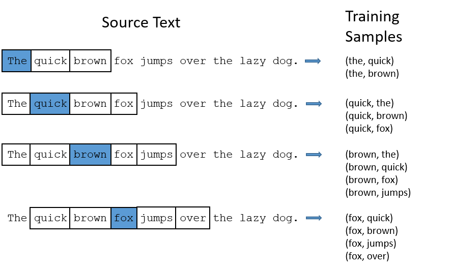

공부하며 생각과 코드를 정리해두는 저장소

# Word2Vec

## Word2Vec 개요

NN에 input으로 text를 넣을 수 없다.
> text를 vector로 바꾸는 작업이 필요하다.

가장 간단한 방법은 encoding이다. 그 중에서도 one-hot encoding을 사용해보자.
> encoding은 말 그대로 각 단어를 하나의 벡터로 맵핑만 한 것
> 각각의 벡터간의 similarity가 없다.


encoding의 문제점을 해결하기 위해서, embedding을 사용해보자
> one-hot encoding 의 차원(단어 수) 보다 작은 차원 공간으로 embedding 벡터를 만들자.

즉, 기존의 one-hot encoding 의 sparse 한 행렬이라는 문제점을 차원 축소로 dense한 행렬를 생성하여 해결하자.
> embedding 벡터끼리 simiarity를 계산할 수 있게된다.


차원 축소 알고리즘은 여러가지(PCA, AutoEncoder..)가 있지만
> word embedding을 구현하기 위해서 word2vec을 사용해보자.
 
word2vec의 기본 전제는 같이나오는 단어(윈도우 내에 존재)끼리 유사도가 있을 것이라는 가정이 있다.
> 같이 나오는 단어가 꼭 유사도가 있지는 않지만 이를 감안하고 수행 (한계점)

## Skip-gram 이 CBOW 보다 좋은 성능을 갖는 이유

```
학습 후 사용할 벡터는 중심단어에 대한 임베딩이다.
CBOW는 중심단어(벡터)의 업데이트 기회는 단 한번이다.
(주변 단어 N 개를 가지고 중심단어 1번 업데이트)
하지만 Skip-gram은 1개의 중심단어에 대해서 N개의 주변단어를 각각 학습 시키므로 총 N번의 업데이트를 수행한다.
예를들어 윈도우 크기가 2인 Skip-gram은 중심단어가 4번(주변 단어수) 업데이트됨
```


위와 같이 skip-gram은 중심단어가 여러번의 update 기회를 갖는다.

그러므로 보통 skip-gram이 CBOW보다 좋은 성능을 낸다고 알려져있다.


```
word2vec은 일종의 NN으로 AutoEncoder와 비슷한 구조를 가진다.
하지만, input과 label 이 동일한 autoencoder와 다르게 
skip-gram은 input이 중심단어, label 이 주변단어가 된다.
```


